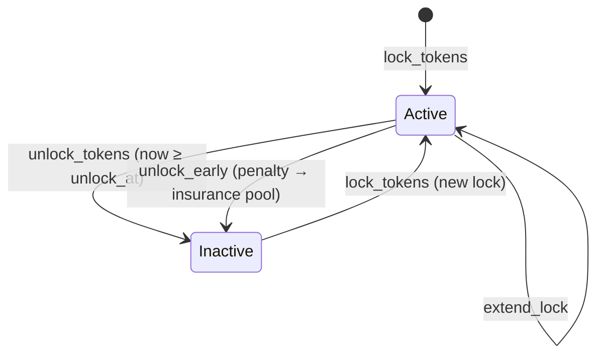

# Time-Weighted Voting (Token Locks)

> For **DAO operators** configuring the feature and **integrators** calling the lock/unlock entry points.
> Source of truth: `contracts/vault/src/lib.rs` (Time-Weighted Voting section), `TokenLock` / `TimeWeightedConfig` in `contracts/vault/src/types.rs`, and `calculate_voting_power` in `contracts/vault/src/storage.rs`.

Time-weighted voting lets an address lock tokens in the vault for a fixed number of ledgers in exchange for a voting-power multiplier. The longer the lock, the bigger the multiplier. Tokens can be withdrawn early, but an early-unlock penalty is deducted and moved into the vault's **insurance pool** for that token.

All durations are in **ledgers** (~5 seconds each, so **1 day ≈ 17,280 ledgers**).

---

## 1. Configuration

The feature is off by default. An Admin turns it on with `set_time_weighted_config`.

```rust
pub struct TimeWeightedConfig {
    pub enabled: bool,                 // master switch
    pub min_lock_duration: u64,        // ledgers
    pub max_lock_duration: u64,        // ledgers
    pub apply_decay: bool,             // linear decay of power toward unlock
    pub early_unlock_penalty_bps: u32, // 1000 = 10%
}
```

| Field | Default | Meaning |
|---|---|---|
| `enabled` | `false` | When `false`, **every** lock entry point (including `unlock_tokens`) returns `Unauthorized`, and `get_voting_power` returns `1`. |
| `min_lock_duration` | `120,960` (7 days) | Shortest duration accepted by `lock_tokens`. |
| `max_lock_duration` | `12,614,400` (730 days) | Longest duration accepted by `lock_tokens` and the ceiling for `extend_lock`. |
| `apply_decay` | `true` | If `true`, `get_voting_power` decays linearly to zero at `unlock_at`. |
| `early_unlock_penalty_bps` | `1000` (10%) | Share of the locked amount kept by the vault on `unlock_early`. |

> ⚠️ **Disabling the feature freezes existing locks.** `unlock_tokens` and `unlock_early` both check `enabled`, so setting `enabled = false` while locks are outstanding leaves those tokens in the vault until the feature is re-enabled. Drain or migrate locks before turning it off.

> `set_time_weighted_config` does not validate its fields and emits no event. Keep `min_lock_duration ≤ max_lock_duration` and `early_unlock_penalty_bps ≤ 10_000` yourself.

---

## 2. Multiplier table

`TokenLock::calculate_multiplier(duration)` maps the lock duration (in ledgers) to a multiplier in basis points (`10_000` = 1.0×). Each tier's lower bound is inclusive.

| Lock duration | Ledgers | Multiplier (bps) | Multiplier |
|---|---|---|---|
| < 30 days | `< 518,400` | `10,000` | 1.0× |
| 30 – < 90 days | `518,400 – 1,555,199` | `15,000` | 1.5× |
| 90 – < 180 days | `1,555,200 – 3,110,399` | `20,000` | 2.0× |
| 180 – < 365 days | `3,110,400 – 6,307,199` | `30,000` | 3.0× |
| ≥ 365 days | `≥ 6,307,200` | `40,000` | 4.0× |

With the default bounds, the shortest allowed lock (7 days) earns 1.0×, and any lock from 365 to 730 days earns the maximum 4.0×.

---

## 3. Voting power formula

`get_voting_power(owner)` (backed by `storage::calculate_voting_power`) returns:

```
if !config.enabled or owner has no lock:
    power = 1

base_power = amount × multiplier_bps / 10_000              (0 if lock inactive)

if config.apply_decay:
    power = base_power × (unlock_at − now) / duration      (0 once now ≥ unlock_at)
else:
    power = base_power

if power == 0:
    power = 1                                               (floor)
```

All divisions are integer divisions (truncating). The floor of `1` means every address keeps at least one unit of power, even after its lock has expired or been withdrawn.

### Worked example

Alice locks **1,000** tokens for **180 days** (`3,110,400` ledgers) at ledger `1,000,000`.

- Multiplier: 180 days lands in the 3.0× tier → `30,000` bps.
- `unlock_at = 1,000,000 + 3,110,400 = 4,110,400`.
- `base_power = 1,000 × 30,000 / 10,000 = 3,000`.

| Ledger | Remaining | Power (`apply_decay = true`) | Power (`apply_decay = false`) |
|---|---|---|---|
| 1,000,000 (lock) | 3,110,400 | 3,000 | 3,000 |
| 2,555,200 (halfway) | 1,555,200 | 1,500 | 3,000 |
| 3,851,200 (≈15 days left) | 259,200 | 250 | 3,000 |
| ≥ 4,110,400 (expired) | 0 | 1 (floor) | 3,000 until unlocked |

### How locks feed proposal voting

`get_voting_power` is a read-only view. Proposal threshold checks read the lock directly through `get_snapshot_voting_power`, depending on the active `VotingStrategy`:

| Strategy | Per-voter weight |
|---|---|
| `Quadratic` | `isqrt(lock.amount)` for an active lock (multiplier ignored), else `1` |
| `Conviction` | `lock.amount × power_multiplier_bps / 10_000` for an active lock (no decay), else `1` |
| `Simple`, `Weighted` | `1` (locks are not consulted) |

---

## 4. Lifecycle



Each address holds **at most one** lock at a time. An inactive lock is overwritten by the next `lock_tokens` call.

---

## 5. Entry points

### `lock_tokens(owner: Address, token: Address, amount: i128, duration: u64) -> Result<(), VaultError>`

Transfers `amount` of `token` from `owner` into the vault and records an active `TokenLock`.

- **Auth:** `owner`
- **Checks:** feature enabled; `amount > 0`; `min_lock_duration ≤ duration ≤ max_lock_duration`; no active lock already held by `owner`.
- **Effects:** `unlock_at = now + duration`; multiplier from the table above.
- **Event:** `tokens_locked` → `(owner, amount, duration, power_multiplier_bps)`
- **Errors:** `Unauthorized` (disabled), `InvalidAmount` (amount or duration out of range), `AlreadyApproved` (an active lock already exists).

### `extend_lock(owner: Address, additional_duration: u64) -> Result<(), VaultError>`

Pushes `unlock_at` further out and recomputes the multiplier.

- **Auth:** `owner`
- **Math:** `new_duration = (unlock_at − now, floored at 0) + additional_duration`; then `unlock_at = now + new_duration`, `duration = new_duration`, multiplier = `calculate_multiplier(new_duration)`.
- **Checks:** feature enabled; lock exists and is active; `new_duration ≤ max_lock_duration`. (`min_lock_duration` is not re-checked.)
- **Event:** `lock_extended` → `(owner, new_duration, power_multiplier_bps)`
- **Errors:** `Unauthorized`, `ProposalNotFound` (no lock), `ProposalNotPending` (lock inactive), `InvalidAmount` (exceeds max).

> ⚠️ The multiplier is based on the **remaining** time plus the extension, not the original duration, so an extension can *lower* the multiplier. Example: a 365-day lock (4.0×) with 60 days left, extended by 10 days, becomes a 70-day lock → 1.5×. Because `duration` is reset, decayed power restarts from the full (new) base power.

### `unlock_tokens(owner: Address) -> Result<i128, VaultError>`

Returns the full locked amount once the lock has matured.

- **Auth:** `owner`
- **Checks:** feature enabled; lock exists and is active; `now ≥ unlock_at`.
- **Returns:** amount returned.
- **Event:** `tokens_unlocked` → `(owner, amount)`
- **Errors:** `Unauthorized`, `ProposalNotFound`, `ProposalNotPending`, `TimelockNotExpired` (still locked).

### `unlock_early(owner: Address) -> Result<i128, VaultError>`

Withdraws before `unlock_at`, paying the configured penalty.

- **Auth:** `owner`
- **Behaviour:** if the lock has already matured it simply calls `unlock_tokens` (no penalty, emits `tokens_unlocked`). Otherwise:
  - `penalty = amount × early_unlock_penalty_bps / 10_000` (truncated)
  - `returned = amount − penalty` is transferred to `owner`
  - `penalty` is added to the vault's insurance pool for `lock.token` (`storage::add_to_insurance_pool`)
- **Returns:** the amount sent back to the owner.
- **Event:** `early_unlock` → `(owner, returned_amount, penalty)`
- **Errors:** `Unauthorized`, `ProposalNotFound`, `ProposalNotPending`.

### `get_voting_power(owner: Address) -> i128`

Read-only. See [§3](#3-voting-power-formula).

### `get_token_lock(owner: Address) -> Option<TokenLock>`

Read-only. Returns the raw lock record (active or not).

### `set_time_weighted_config(admin: Address, config: TimeWeightedConfig) -> Result<(), VaultError>`

- **Auth:** `admin`, whose role must satisfy `Admin`.
- **Errors:** `InsufficientRole`.
- **Event:** none.

### `get_time_weighted_config() -> TimeWeightedConfig`

Read-only. Returns the defaults listed in §1 if nothing has been stored.

---

## 6. Early-unlock penalty examples

The penalty stays inside the vault's token balance, tracked in the per-token insurance pool (see `get_insurance_pool(token)`). An Admin can later move it out with `withdraw_insurance_pool`.

| Locked amount | `early_unlock_penalty_bps` | Penalty → insurance pool | Returned to owner |
|---|---|---|---|
| 1,000 | 1,000 (10%, default) | 100 | 900 |
| 1,000 | 2,500 (25%) | 250 | 750 |
| 1,000 | 0 | 0 (pool untouched) | 1,000 |
| 9,999 | 1,000 (10%) | 999 (truncated from 999.9) | 9,000 |
| 5 | 1,000 (10%) | 0 (truncated from 0.5) | 5 |

Truncation always rounds the penalty **down**, in the owner's favour.

### End-to-end example

1. Admin enables the feature with defaults (10% penalty).
2. Bob calls `lock_tokens(bob, USDC, 10_000, 1_555_200)` (90 days → 2.0×). 10,000 USDC moves into the vault.
3. 30 days later Bob calls `unlock_early(bob)`.
   - `penalty = 10_000 × 1_000 / 10_000 = 1_000`
   - Bob receives **9,000 USDC**; `get_insurance_pool(USDC)` increases by **1,000**.
   - Event: `early_unlock(bob, 9_000, 1_000)`.
4. Bob's lock is now inactive; he may call `lock_tokens` again to start a new one.

---

## 7. Events summary

| Topic | Data | Emitted by |
|---|---|---|
| `tokens_locked` | `(owner: Address, amount: i128, duration: u64, power_multiplier_bps: u32)` | `lock_tokens` |
| `lock_extended` | `(owner: Address, new_duration: u64, power_multiplier_bps: u32)` | `extend_lock` |
| `tokens_unlocked` | `(owner: Address, amount: i128)` | `unlock_tokens`, `unlock_early` on a matured lock |
| `early_unlock` | `(owner: Address, returned_amount: i128, penalty: i128)` | `unlock_early` |

See also: [API reference](../reference/API.md), [Event reference](../reference/EVENTS.md).
