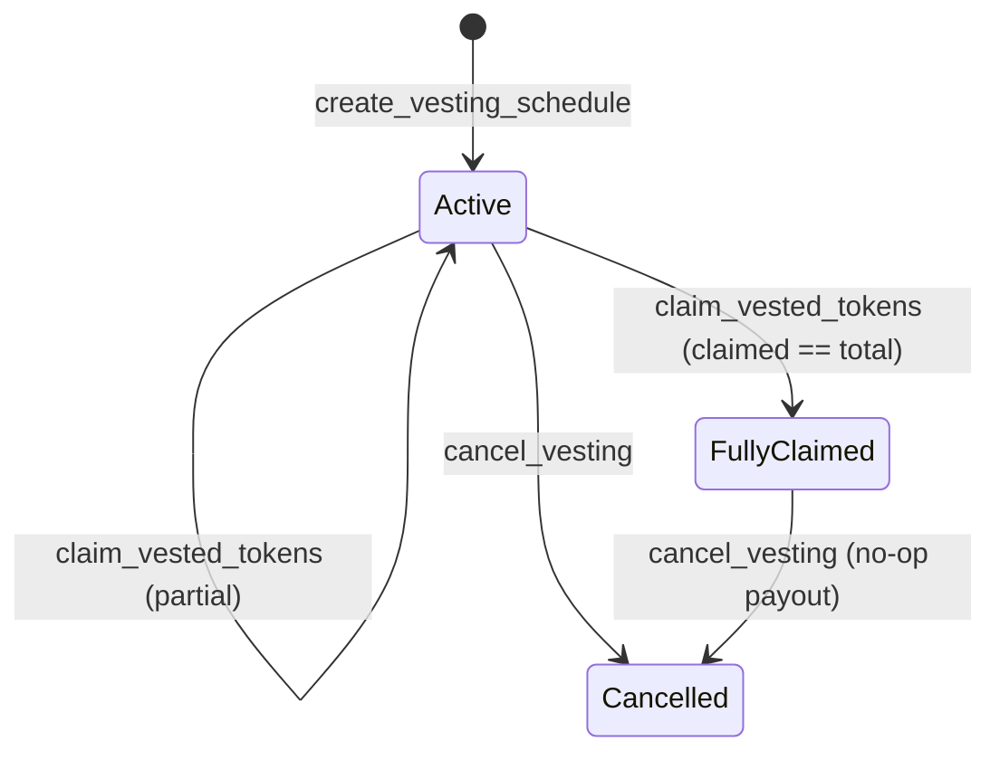

# Token Vesting

> For **DAO operators** granting tokens to contributors and **integrators** building claim UIs.
> Source of truth: the "Token vesting" section of `contracts/vault/src/lib.rs`, `VestingSchedule` in `contracts/vault/src/types.rs`, and the vesting helpers in `contracts/vault/src/storage.rs`.

A vesting schedule earmarks part of the vault's balance of a token for a beneficiary and releases it linearly over time, with an optional cliff. The beneficiary pulls vested tokens with `claim_vested_tokens`; an Admin can stop a schedule with `cancel_vesting`.

All positions are **absolute ledger sequence numbers** (not durations and not timestamps). A ledger closes roughly every 5 seconds, so **1 day ≈ 17,280 ledgers**.

---

## 1. The schedule

```rust
pub struct VestingSchedule {
    pub id: u64,              // assigned by the contract, starts at 1
    pub beneficiary: Address, // only address allowed to claim
    pub token: Address,       // token held by the vault
    pub total: i128,          // total amount that will vest
    pub cliff_ledger: u32,    // nothing is claimable before this ledger
    pub start_ledger: u32,    // vesting clock starts here
    pub end_ledger: u32,      // everything is vested at/after this ledger
    pub claimed: i128,        // amount already paid out
    pub cancelled: bool,
}
```

### Cliff / start / end semantics

| Field | Meaning |
|---|---|
| `start_ledger` | The point the linear curve is measured from. Can be in the past, present or future. |
| `cliff_ledger` | Gate: before it, the vested amount is `0`. At the cliff the beneficiary "catches up" on everything accrued since `start_ledger`. Set `cliff_ledger = start_ledger` for no cliff. |
| `end_ledger` | From this ledger on, the full `total` is vested. |

Creation requires `start_ledger ≤ cliff_ledger < end_ledger` (which also implies `start_ledger < end_ledger`) and `total > 0`.

### Limits

- **100 active schedules** vault-wide. A schedule counts as active from creation until it is fully claimed or cancelled. Creating a 101st returns `BatchTooLarge`.
- **Balance reservation:** when a schedule is created the vault checks `balance(token) − reserved(token) ≥ total`, then adds `total` to `reserved(token)`. Claims and cancellations release the reservation. Tokens are **not** moved at creation; they stay in the vault.
  - The reservation is only consulted when creating new vesting schedules. Other outflows (proposals, streams, etc.) do not check it, so operators should keep enough balance to honour outstanding schedules.

---

## 2. Vesting math

`vested_amount(schedule, ledger)`:

```
if ledger < cliff_ledger:   vested = 0
elif ledger >= end_ledger:  vested = total
else:                       vested = total × (ledger − start_ledger) / (end_ledger − start_ledger)

claimable = vested − claimed
```

Division truncates, so fractional amounts are paid out on a later claim (the final claim at or after `end_ledger` always pays the remainder up to exactly `total`). If `total × elapsed` overflows `i128` the call fails with `InvalidAmount`.

### Worked example

A contributor is granted **1,200,000** tokens over **360 days** with a **90-day cliff**, starting at ledger `2,000,000`:

| Parameter | Value |
|---|---|
| `start_ledger` | `2,000,000` |
| `cliff_ledger` | `2,000,000 + 90 × 17,280 = 3,555,200` |
| `end_ledger` | `2,000,000 + 360 × 17,280 = 8,220,800` |
| duration | `6,220,800` ledgers |

| Ledger | Days in | Vested | Notes |
|---|---|---|---|
| 3,000,000 | ~58 | 0 | before the cliff |
| 3,555,200 | 90 | 300,000 | cliff: 90/360 of the grant unlocks at once |
| 5,110,400 | 180 | 600,000 | |
| 6,665,600 | 270 | 900,000 | |
| ≥ 8,220,800 | 360 | 1,200,000 | fully vested |

If the beneficiary claims at day 90 (300,000) and again at day 180, the second claim pays `600,000 − 300,000 = 300,000`.

---

## 3. Lifecycle



- **Active** — counts toward the 100-schedule cap; `total − claimed` is reserved.
- **FullyClaimed** — `claimed == total`; removed from the active count; nothing reserved.
- **Cancelled** — terminal; claims return `Unauthorized`.

---

## 4. Entry points

### `create_vesting_schedule(admin, beneficiary, token_addr, total, cliff_ledger, start_ledger, end_ledger) -> Result<u64, VaultError>`

| Parameter | Type |
|---|---|
| `admin` | `Address` |
| `beneficiary` | `Address` |
| `token_addr` | `Address` |
| `total` | `i128` |
| `cliff_ledger` | `u32` |
| `start_ledger` | `u32` |
| `end_ledger` | `u32` |

- **Auth:** `admin`, whose role must be exactly `Admin`.
- **Checks:** `total > 0`; `start_ledger ≤ cliff_ledger < end_ledger`; fewer than 100 active schedules; unreserved vault balance of `token_addr` ≥ `total`.
- **Returns:** the new schedule id.
- **Event:** `vesting_created`.
- **Errors:** `Unauthorized` (not Admin), `InvalidAmount` (bad amount or ledger ordering), `BatchTooLarge` (100-schedule cap), `InsufficientBalance` (not enough unreserved balance).

### `claim_vested_tokens(beneficiary: Address, schedule_id: u64) -> Result<i128, VaultError>`

- **Auth:** `beneficiary`, who must match the schedule's beneficiary.
- **Behaviour:** transfers `vested − claimed` to the beneficiary, bumps `claimed`, releases that much of the reservation. When `claimed` reaches `total` the schedule stops counting toward the cap.
- **Returns:** the amount transferred. Returns `Ok(0)` without emitting an event when nothing is claimable (e.g. before the cliff).
- **Event:** `vesting_claimed`.
- **Errors:** `ProposalNotFound` (unknown id), `Unauthorized` (wrong beneficiary or cancelled schedule), `InvalidAmount` (overflow).

### `cancel_vesting(admin: Address, schedule_id: u64) -> Result<i128, VaultError>`

- **Auth:** `admin`, whose role must be exactly `Admin`.
- **Behaviour:**
  1. Already cancelled → `Ok(0)`, no event.
  2. Fully claimed → marked cancelled, `Ok(0)`, no event.
  3. Otherwise: anything **vested but unclaimed** is paid to the beneficiary immediately, the **unvested** remainder is un-reserved (it stays in the vault as free treasury balance), the schedule is marked cancelled and removed from the active count.
- **Returns:** the unvested amount returned to the treasury.
- **Event:** `vesting_cancelled` (case 3 only).
- **Errors:** `Unauthorized` (not Admin), `ProposalNotFound` (unknown id), `InvalidAmount` (overflow).

#### Cancellation example

Using the schedule from §2, the Admin cancels at day 180 (ledger `5,110,400`) after the beneficiary claimed 300,000 at the cliff:

- `vested = 600,000`, `vested_unclaimed = 600,000 − 300,000 = 300,000` → sent to the beneficiary.
- `unvested = 1,200,000 − 600,000 = 600,000` → released back to the treasury; returned by the call.
- Event: `vesting_cancelled(id)` → `(admin, 300_000, 600_000)`.

### `get_vesting_schedule(schedule_id: u64) -> Option<VestingSchedule>`

Read-only. Returns `None` for an unknown id.

---

## 5. Events

Vesting events use a **two-element topic**: the event name and the schedule id.

| Topic | Data |
|---|---|
| `("vesting_created", id: u64)` | `(beneficiary: Address, token: Address, total: i128, cliff_ledger: u32, end_ledger: u32)` |
| `("vesting_claimed", id: u64)` | `(beneficiary: Address, amount: i128, total_claimed: i128)` |
| `("vesting_cancelled", id: u64)` | `(admin: Address, vested_unclaimed_paid: i128, unvested_returned: i128)` |

`start_ledger` is not included in `vesting_created`; read it with `get_vesting_schedule` if an indexer needs the full curve.

See also: [API reference](../reference/API.md#token-vesting), [Event reference](../reference/EVENTS.md#vesting).
